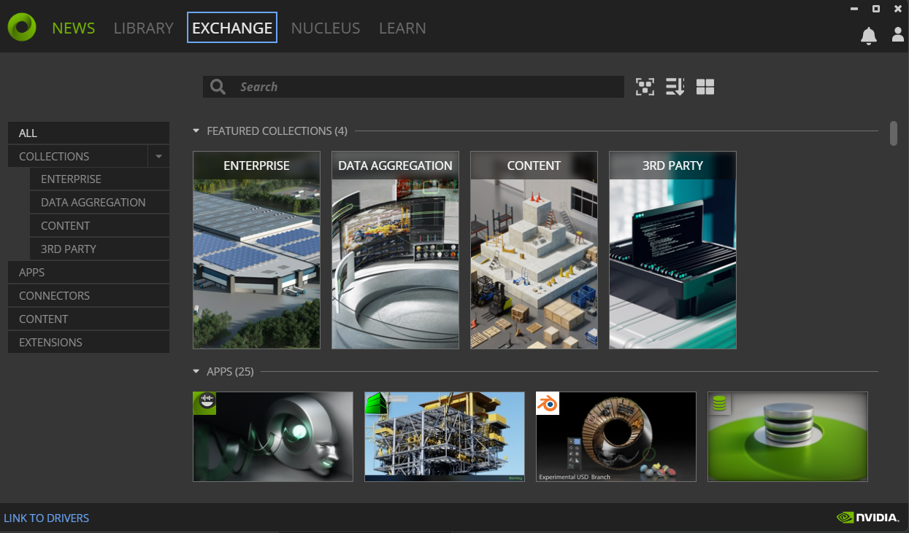
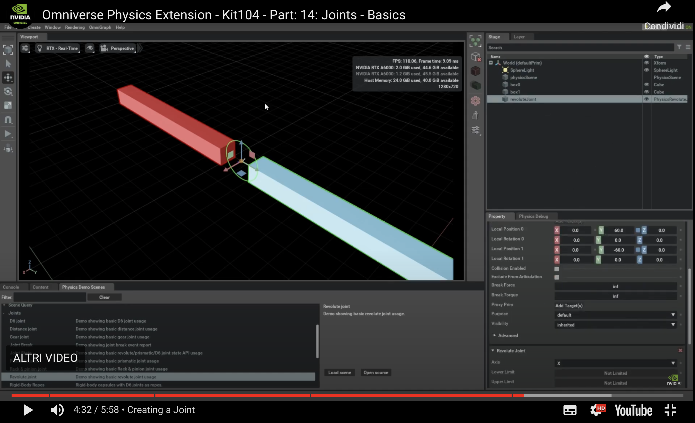
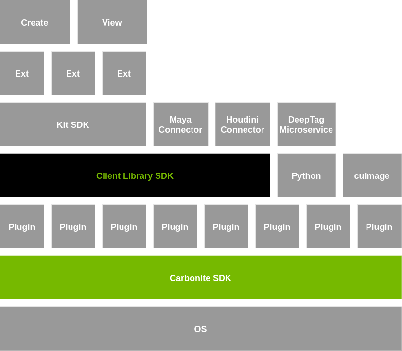
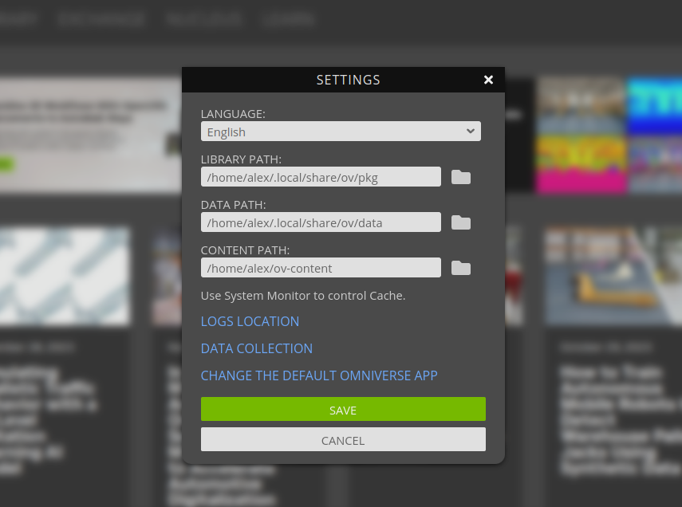

# Omniverse Launcher

Your first taste of Omniverse begins with the [NVIDIA official launcher](https://www.nvidia.com/en-us/omniverse/download/). If you're experimenting with Omniverse for the first time you can freely download and use Omniverse according to the agreements exposed in the [previous section](../chapter1/what_is_omniverse.md).

The Omniverse Launcher allows you to quickly and automatedly install publicly available Omniverse applications like USD Composer or USD Presenter. Just head to the `Exchange` tab and start the download on your local machine.



Head over in the `Launcher`'s `Exchange` and install the `USD Composer` Omniverse app.

One tip that could be useful in automation: when Omniverse launcher is enabled and running in background (either sent to the system tray or in the foreground), it sets up listening ports that a script could use to get information related to the installed Omniverse applications and other Omniverse related data

```bash
$ sudo lsof -i -n -P | grep omniverse | grep LISTEN
omniverse 52092            alex   94u  IPv4 412430      0t0  TCP 127.0.0.1:33480 (LISTEN)
omniverse 52092            alex   98u  IPv4 414060      0t0  TCP 127.0.0.1:34080 (LISTEN)
$ curl -s http://127.0.0.1:33480/components # Perform a simple GET request
# ... lots of json here including installed apps on the local filesystem ....
[{"links":[{"title":"Release Notes","url":"https://docs.omniverse.nvidia.com/prod_nucleus/...
"install":{"path":"/home/alex/.local/share/ov/pkg/create-2023.3.0-beta/pull_kit_sdk.sh",
"root":"/home/alex/.local/share/ov/pkg/create-2023.3.0-beta","args":["-q"]}}],"newlyInstalled":false,"packages":[]}]
```

The json output can obviously be parsed with `jq` or similar tools and used in automation scripts. The `http://127.0.0.1:33480` address will also open the `Exchange` UI in a browser.

The second listed port is another listening port (so it can be accessed in any browser via `http://127.0.0.1:34080`) for the [Omniverse Navigator](https://docs.omniverse.nvidia.com/navigator/latest/index.html) - the same can also be accessed in the launcher `Nucleus` tab - but we'll take a look at Nucleus at a later time.

## Composer & Presenter

Two of the most famous applications (and some of the very first ones a newcomer might try out) in Omniverse are USD Composer (formerly Create) and USD Presenter (formerly View).

The first is a 3D authoring program which allows users to compose complex scenes from 3D assets, applying physical properties to them, simulating and rendering, applying photorealistic materials and much more

[](https://www.youtube.com/watch?v=3QjFjpUooXI)

Composer/Create is usually not equipped with 3D creation tools to model single 3D assets (think Blender) but rather orchestrates composition of a USD scene from external assets (although it could even become a modeling tool with the right extensions).

Presenter/View instead focuses on visualizing already composed environments and inspecting USD scenes (it doesn’t feature advanced authoring tools as Composer).

For the most parts of this book we will use `USD Composer`.

Almost all Omniverse applications are built on two core technologies: `Carbonite` and `Kit`.

## Carbonite and Kit - the engines of the Omniverse

[Carbonite](https://docs.omniverse.nvidia.com/kit/docs/carbonite/latest/index.html) and [Kit](https://docs.omniverse.nvidia.com/kit/docs/kit-manual/latest/guide/kit_overview.html) are the two fundamental core technologies of Omniverse and they sit at different levels in the Omniverse software stack

```admonish info "Carbonite and Kit in the Omniverse software stack"

```
Both Carbonite and Kit are developed and maintained by NVIDIA and are free to use within the EULA of Omniverse.

At the lowest layer, close to the operating system, there's **Carbonite**.
Carbonite is a SDK which deals with the lower level details and provides platform-independent ABI stable interfaces (called [*Carbonite Interfaces*](https://docs.omniverse.nvidia.com/kit/docs/carbonite/latest/docs/CarboniteInterfaces.html)) so that users can define their own C++ plugins and not worry about compatibility issues for their libraries within the Omniverse ecosystem, low-level facilities similar to those of the C++ standard libraries that span from file operations to multithreading, diagnostic tools (for example the famous `CARB_LOG_WARN("some message here");` logging from C++) and much more.

Carbonite is a solid and extremely reliable foundation and on top of it there are **carbonite plugins**: those are low-level C++ libraries that depend on carbonite (but not on Kit). Carbonite loads those native C++ plugins (there's no python involved here, the Python interpreter is loaded at a higher level and allows Omniverse developers to write extensions in Python on top of these plugins too) and also sets up facilities for the logging, profiling, configurations (and where to store the configuration settings, text config files? Toml files? and where?), tasking (multithreaded task launch without the hassle of the lower level details) and so on.

On top of these things we finally have another powerhorse: **Kit**.
Kit is a higher level SDK for building Omniverse applications and extensions. `USD Composer` (formerly called `Create`) and `USD Presenter` (formerly called `View`) are examples of Kit applications: a bundle of several extensions which provide all of the functionalities from mouse input to viewport rendering to physics simulation, etc.

Kit is also responsible for making major components available to extensions:

* USD and Hydra (a rendering engine for USD) - `omni.usd.libs` is the extension that loads the USD native libraries (if you don't know what these are, it is highly recommended that you study [Learn OpenUSD](https://omniverseusd.github.io/) first before diving more into Omniverse)
* Nucleus accessing facilities (this makes collaborating on USD files easier - it's the `Client Library SDK` in the stack image above)
* Carbonite facilities
* An advanced RTX renderer
* Python scripting
* An entire UI toolkit (`omni.ui`) to create user interfaces quickly for your extensions

Kit is usually provided as an installed executable but it is actually a **carbonite plugin itself**.

Let's create a simple python script which uses carbonite facilities and gets executed by your local kit instance. First locate any locally installed kit instance (if you installed Composer or Presenter or almost any app from the launcher you will have it installed in a local directory). You can find any of the installed paths via the launcher's settings



(or through some `jq` and `curl`-foo by asking the launcher for the installed path, if you're so inclined).

```py
import carb # use carbonite module (kit will make this immediately available)

carb.log_error("Hello error!")
```

Save it as `main.py` and execute it through kit:
```bash
$ ~/.local/share/ov/pkg/create-2023.3.0-beta/kit/kit --exec ./main.py
[Info] [carb] Logging to file: /home/alex/.nvidia-omniverse/logs/Kit/kit/105.2/kit_20231201_190206.log
2023-12-01 18:02:06 [88ms] [Error] [__main__] Hello error!
```

Congratulations: you've just run your first lines of code into Kit.

By default kit only loads basic extensions

```bash
$ ~/.local/share/ov/pkg/create-2023.3.0-beta/kit/kit --list-exts
[Info] [carb] Logging to file: /home/alex/.nvidia-omniverse/logs/Kit/kit/105.2/kit_20231201_190413.log
>>> Begin list of all local extensions:
[0] omni.app.content_browser-1.0.0
[1] omni.app.demo_checkpoint-1.0.0
[2] omni.app.demo_filepicker-1.0.0
[3] omni.app.demo_popup_dialog-1.0.0
[4] omni.app.dev-1.0.0
[5] omni.app.dev.legacy_viewport-1.0.0
[6] omni.app.dev.rtx-1.0.0
[7] omni.app.editor.base-105.2.0
[8] omni.app.empty-0.1.0
[9] omni.app.file_exporter-1.0.0
[10] omni.app.file_importer-1.0.0
[11] omni.app.full-1.0.1
[12] omni.app.hydra-0.1.0
[13] omni.app.mini-0.1.1
[14] omni.app.mini-hydra-0.1.0
[15] omni.app.nvindex-0.2.0
[16] omni.app.nvindex-remote-0.2.0
[17] omni.app.rtx.aovs-1.0.0
[18] omni.app.test_ext-1.0.0
[19] omni.app.test_ext_kit_sdk-1.0.0
[20] omni.app.uidoc-1.0.1
[21] omni.app.usdrt-1.0.1
[22] omni.app.usdrt.hydra-1.0.1
[23] omni.assets.plugins-0.0.0
[24] omni.client-1.0.2
[25] omni.kit.async_engine-0.0.0
[26] omni.kit.registry.nucleus-0.0.0
>>> End list (total: 27).
```

Anyway it can also load any other Omniverse extension by supplying the containing paths through `--ext-folder` directives. For instance you should probably have on your local installation an `exts` and an `extscache` directory that you can supply to kit in order for it to load all of the extensions that can be found in those folders.

Let's modify our `main.py` script in order to modify something and display a custom messagebox by changing a popup dialog from the `omni.app.demo_popup_dialog-1.0.0` extension which is a simple demo GUI extension:

```py
import carb
import omni.kit.window.popup_dialog
from omni.kit.window.popup_dialog import MessageDialog

carb.log_error(f"Hello error! {app._window}")

app._popups[0] = MessageDialog(
    title="Hello this is a customized dialog!",
    message="hello hello",
    ok_handler=lambda dialog: print(f"All is fine"),
)
```

The `MessageDialog` popup is a very simple dialog provided by the [`omni.kit.window.popup_dialog`](https://docs.omniverse.nvidia.com/kit/docs/omni.kit.window.popup_dialog/latest/omni.kit.window.popup_dialog/omni.kit.window.popup_dialog.MessageDialog.html) extension.

```bash
$ ~/.local/share/ov/pkg/create-2023.3.0-beta/kit/kit --ext-folder ~/.local/share/ov/pkg/create-2023.3.0-beta/exts
  --ext-folder ~/.local/share/ov/pkg/create-2023.3.0-beta/extscache --enable omni.app.demo_popup_dialog-1.0.0 --exec ./main.py
# kit starts  up and loads all of the necessary dependencies and dependencies of the dependencies
# in order to run omni.app.demo_popup_dialog
[Info] [carb] Logging to file: /home/alex/.nvidia-omniverse/logs/Kit/kit/105.2/kit_20231201_192759.log
[0.116s] [ext: omni.kit.async_engine-0.0.0] startup
[0.119s] [ext: omni.assets.plugins-0.0.0] startup
[0.120s] [ext: omni.stats-0.0.0] startup
[0.121s] [ext: omni.client-1.0.2] startup
[0.134s] [ext: omni.gpu_foundation-0.0.0] startup
[0.143s] [ext: omni.rtx.shadercache.vulkan-1.0.0] startup
[0.144s] [ext: carb.windowing.plugins-1.0.0] startup
[0.151s] [ext: omni.kit.renderer.init-0.0.0] startup
[0.824s] [ext: omni.kit.loop-default-0.2.0] startup
[0.825s] [ext: omni.appwindow-1.1.5] startup
[0.829s] [ext: omni.kit.renderer.core-0.0.0] startup
[1.061s] [ext: omni.kit.renderer.capture-0.0.0] startup
[1.063s] [ext: omni.kit.renderer.imgui-0.0.0] startup
[1.140s] [ext: carb.audio-0.1.0] startup
[1.161s] [ext: omni.ui-2.21.9] startup
[1.173s] [ext: omni.uiaudio-1.0.0] startup
[1.174s] [ext: omni.kit.mainwindow-1.0.1] startup
[1.175s] [ext: omni.kit.uiapp-0.0.0] startup
[1.175s] [ext: omni.kit.actions.core-1.0.0] startup
[1.177s] [ext: omni.kit.window.popup_dialog-2.0.23] startup
[1.181s] [ext: omni.kit.commands-1.4.9] startup
[1.186s] [ext: omni.app.demo_popup_dialog-1.0.0] startup
[1.221s] app ready
# now our script is finally executed
2023-12-01 18:28:01 [1,218ms] [Error] [__main__] Hello error! DemoPopup
```

if you now click the first button of the window, it should activate your modified callback and create the `Hello this is a customized dialog!` window.

In the command used, with the `--enable` directive we singularly activated an extension (which must be found somewhere: either in the folders passed through the various `--ext-folder` or downloaded from a registry). A [registry](https://docs.omniverse.nvidia.com/kit/docs/omni.kit.registry.nucleus/latest/Overview.html) is a nucleus feature which allows kit applications to download dependencies via network. In the case above, had we not given the `--ext-folder` paths to find the locally installed extensions, the client nucleus extension would have downloaded the missing required dependencies from the default registry - the public NVIDIA one. Unless configured otherwise (your own company could use kit apps by loading them via `.kit` files which are text configuration files and where a custom your-company-only registry could have been used).

It can be useful to note that python-based extensions loaded are obviously comprised by python scripts: as long as kit knows where to find those `script.py` files, they can be safely executed through `--exec`. An example:

```bash
$ ~/.local/share/ov/pkg/create-2023.3.0-beta/omni.create.sh --exec 'open_stage.py /home/alex/usd_projects/my_cool_scene.usd'
  --/app/content/emptyStageOnStart=true
```

The command above will start kit via `omni.create.sh` on unix platforms (or equivalently `omni.create.bat` on Windows platforms) which is a shell script that, at the end of the day, invokes kit with just a text `.kit` file so it can instruct kit what extensions to load, what settings does it have to use, etc.

```bash
~/.local/share/ov/pkg/create-2023.3.0-beta$ ls apps
# Inside the `apps` folder there are text files .kit which if opened with kit, will
# load a predefined set of extensions listed in that same text file and customize kit
# in order to look as a completely different Omniverse app each time
exts.deps.generated.kit
omni.composer.kit
omni.create.hdstorm.kit
omni.create.legacy_viewport.kit
omni.create.testing.kit
omni.app.uidoc.kit
omni.create.full.kit
omni.create.kit
omni.create.racer.kit
omni.create.xr.kit
```

i.e. something like

```bash
$ ~/.local/share/ov/pkg/create-2023.3.0-beta/kit/kit ~/.local/share/ov/pkg/create-2023.3.0-beta/apps/omni.create.kit ..other_args..
```

This is described in great detail in the [official documentation on kit files](https://docs.omniverse.nvidia.com/kit/docs/kit-manual/latest/guide/configuring.html) so it is highly encouraged to take a look at it.

So as long as the `open_stage.py` script (which is always installed along with the python extension `omni.usd`, e.g. in `~/.local/share/ov/pkg/create-2023.3.0-beta/extscache/omni.usd-1.10.22+17c3cf39.lx64.r.cp310/scripts/open_stage.py`) can be found by the kit executable, it can be executed.

The final `--/app/content/emptyStageOnStart=true` overrides a default setting (in the namespace `/app/content`) to instruct kit, when loading everything that is needed in the `omni.create.kit` file with default values for each setting, _not_ to start Omniverse USD Composer/Create with an empty stage: this is necessary otherwise our `my_cool_scene.usd` stage would have been loaded but then discarded because of Composer/Create loading an empty default stage template at startup.

At this point you should hopefully have developed a pretty good understanding of the main components of a regular Omniverse kit-based application and how the local architectural pieces operate together when you install something from the launcher.

Omniverse is meant to be an open platform that your company/business/personal workflow can leverage to automate, create custom advanced graphical services, quickly use and compose in whatever way you want AI services, world-class rendering technologies, industry-standard USD facilities and much more. Omniverse is **flexible** and you can hack it / tweak it / program it to do pretty much whatever you want it to do for you.
