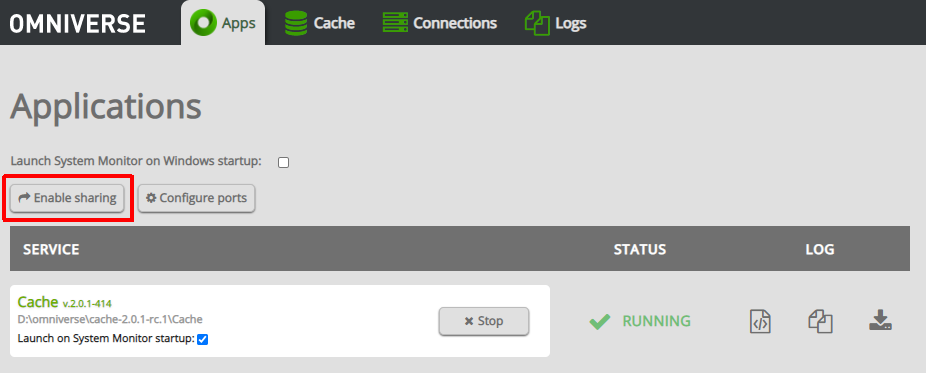

# Nucleus

This section will present a brief overview of the Omniverse Nucleus feature. For in-depth informations it is recommended to check the [official Nucleus documentation](https://docs.omniverse.nvidia.com/nucleus/latest/index.html).

Nucleus is both a database and a collaboration engine for Omniverse. Nucleus allows multiple people to work on the same USD files collaboratively, non-destructively and having their changes synchronized in real-time across multiple people working on 3D assets, scene design and/or physical simulations setup, etc.

Nucleus is an advanced tool meant for Enterprise users (along with an Enterprise Omniverse license) but it can be freely used on a local workstation for teams up to 2 users [as stated in the official docs](https://docs.omniverse.nvidia.com/nucleus/latest/index.html).

## Workstation Nucleus

The local usage of Nucleus, up to 2 users, starts in the launcher with `Add Local Nucleus Server`

this will fire up a guided procedure to set up an administrator account for your local Nucleus server (think of installing a MySQL database locally). You'll eventually be able to connect to your local Nucleus server and navigate in its directories through the Nucleus Navigator (again: available from the Launcher in the `Nucleus` tab or in the browser as discussed in the previous section).

The user interface should be quite easy to understand for people familiar with a unix environment: users, access permissions, folders organizations.. these are all features available in Nucleus.

If you want another person to join your local Nucleus instance, head over to the navigator and in the `Apps` tab choose `Enable sharing`

After that just add another user from the Nucleus navigator and make sure the other person can reach your ip and port through your shared network. The other person will be able to use a generated invite link and/or manually add your local server to connect to

Both users are now able to launch a Kit application like OV Composer, connect to the shared Nucleus server (each application might have a different way to connect to Nucleus, for OV Composer you should add a new connection in the `Content` explorer)

and pick a USD file (or save one) from that Nucleus server. The other person should do the same and you can both collaborate on the same USD file. Pretty much like `git` or any version control, _checkpoints_ will be generated along with recording the user who did the edit (and it's always possible to go back to a previous modification).

Together with the power of USD layers (and **again: it is highly recommended, if you haven't already, to take a look at the [OpenUSD](https://learnusd.github.io) file format**), Nucleus makes working on graphical assets and scenes an advanced experience.

For more information refer to the [video guide in the official docs](https://docs.omniverse.nvidia.com/nucleus/latest/index.html): it is both easy to follow and very informative.

## Enterprise Nucleus

Enterprise Nucleus Server can be deployed both on-premises or in a CSP (AWS/Azure/GCP/etc.). It includes a better caching mechanism, backup systems, SSO integrations, secure data transfers and other advanced features typically designed for enterprises.

Once again you'll be able to find how to set enterprise servers up, configure them or deploy images/containers to CSPs in the official docs, e.g. using AWS' CDK to generate the CloudFormation templates necessary for deployment on EC2 ([code example here](https://github.com/aws-samples/nvidia-omniverse-nucleus-on-amazon-ec2)).

Enterprise Nucleus can also use [_DeepSearch_](https://docs.omniverse.nvidia.com/services/latest/services/deepsearch/client/using_deepsearch_ui.html): a AI-powered research engine which makes it easy to search for 3D assets in a large assets library for your organization (e.g. searching through 3D assets related to the word `coffee` might return the paths in your organization's Nucleus server for cups, coffee bean sacks, coffee pots and other semantically-related coffee assets).

# Connectors

Connectors are usually Omniverse plugins that use the [Client Library SDK](../chapter1/kit_applications.md) and typically connect to a Nucleus server to import/export (bidirectionally or sometimes unidirectionally - depends on the applications involved) OpenUSD files and *live-sync* modifications between a digital content creation program (_DCC_ - this could be Blender, Maya, Unreal Engine, etc.) and Omniverse clients (a custom made app / a user using OV Composer / a user presenting in OV Presenter your work to customers, etc.).

Connectors can be installed as Maya plugins, Unreal Engine plugins, Blender add-ons, etc.. and can be found in the Launcher's `Exchange` by filtering for `Connectors`

Of course if there's no connector for the software that you'd like to link up to Omniverse, you can always [develop your own connector](https://docs.omniverse.nvidia.com/connect/latest/developing-connectors.html) by leveraging the connector samples and documentation. Knowledge of the OpenUSD format is usually required. Both C++ and Python code samples are available.

# Services

Microservices are the last important category of Omniverse extensions: these are lightweight Omniverse extensions that leverage the `omni.services` extension to register REST endpoints (similar to normal REST API routes) and are meant to be called from the cloud or from a [Omniverse Farm](https://docs.omniverse.nvidia.com/farm/latest/index.html).

For more information on how to develop microservices [the official documentation](https://docs.omniverse.nvidia.com/services/latest/design/getting_started.html) has some good resources. We'll take a deeper look at how to develop Omniverse extensions in the following chapters; developing microservices will not be much different.