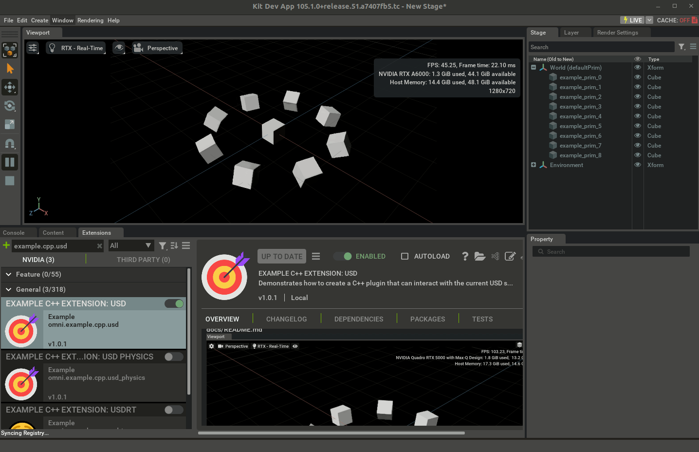

# Mixed/Hybrid Omniverse C++ and Python extensions

```admonish tip title="GitHub Code"
<p style="display: flex; align-items: center;">
  
  All the code in this section is available in the public NVIDIA repository:&nbsp;<a href="https://github.com/NVIDIA-Omniverse/kit-extension-template-cpp">kit-extension-template-cpp</a>. Read on for an in-depth explanation.
</p>
```

When you have Python and C++ mixed (sometimes referred as _hybrid_) Omniverse extensions, the extension manager usually works with Python object returned from some `get_extensions()` method: that's why in the `omni.example.cpp.usd` extension (and other mixed extensions like `omni.example.cpp.pybind`) in the sample repo `kit-extension-template-cpp` the extension entry point is in the Python scripts:

```py
# This is usually in a file in the scripts/ folder
import omni.ext

class ExampleMixedExtension(omni.ext.IExt): # entry point for the extension
    def __init__(self):
        super().__init__()
        # here one can also call C++ methods from the pybind11 bindings of this same extension (see folder bindings/)

    def on_shutdown(self):
        pass
```

from the Python code the extension can execute other Python code and also invoke the Carbonite framework and Carbonite plugins. As already stated in the [previous section](../chapter2/cpp_extensions.md), the Carbonite `omni::ext::IExt` interface is instead a special type of Carbonite interface that allows the Carbonite plugin to be registered as a Kit extension (i.e. something of a higher object that can be used by the Kit extensions system).

That said, let's now take a look at how mixed extensions implement C++/Python bindings to let Python extensions communicate and use C++ Carbonite plugin interfaces.

`omni.example.cpp.usd` is a good example for Python-C++ mixed interoperativity.

After building the `kit-extension-template-cpp` repo (`./build.sh -r` to only build release), one can just run `/tmp/kit-extension-template-cpp$ ./_build/linux-x86_64/release/omni.app.kit.dev.sh`, open the `Window->Extensions` Extension Browser and activate the `omni.example.cpp.usd` extension. The extension is found locally from the compiled repository (somewhere in the `_build` folder) thanks to the `.kit` file that the Kit app is being launched with:

```bash
$ cat source/apps/omni.app.kit.dev.kit
[package]
title = "Kit Dev App With Example Extensions"
description = "The default kit dev app with extensions from this repo made available."
version = "1.0.0"
keywords = ["app"]

[dependencies]
"omni.app.dev" = {}

[settings.app.exts]
folders.'++' = ["${app}/../exts"] # This adds the _build/linux-x86_64/release/exts path to the extensions list!

[[test]]
enabled = false

```
For more information on this check the [`Extension Search Path`](https://docs.omniverse.nvidia.com/kit/docs/kit-manual/latest/guide/extensions_advanced.html#extension-search-paths) documentation: we basically made our local extensions visible to the launched kit app (which looks a bit like a miniature Omniverse USD Composer).



## Python bindings

The `omni.example.cpp.usd` example shows a typical folder structure in Omniverse mixed extensions: the `bindings/` folder is the common place where to store C++ files for the C++/Python pybind11 bindings.

```admonish info title="pybind11"
[pybind11](https://github.com/pybind/pybind11) is a high-performance open-source commercially-viable Python-C++ binding library.
It allows to:
* use C++ classes and functions in Python as if they were native Python objects
* Pass Python objects to C++ functions and return C++ objects to Python
* Define custom operators, iterators, callbacks, and exceptions for your C++ types

..and much more.
It also minimizes the overhead of calling C++ from Python and viceversa by leveraging modern C++11 features to generate compact and efficient code that can run faster than pure Python or other binding libraries (and it's also a lightweight library that only depends on Python and the C++ standard library).

Omniverse employs it by default and provides build system facilities and Carbon support but again - nothing stops a developer from using their own solution.
```

Before taking a look at `bindings/`, let us dissect the C++ files in `plugins/` which expose the Carbonite interfaces that we want to make available from the Python side of the Kit extension:

`source/extensions/omni.example.cpp.usd/plugins/omni.example.cpp.usd/ExampleUsdExtension.cpp`
```cpp
#define CARB_EXPORTS

const struct carb::PluginImplDesc pluginImplDesc = { "omni.example.cpp.usd.plugin",
                                                     "An example C++ extension.", "NVIDIA",
                                                     carb::PluginHotReload::eEnabled, "dev" };
// As seen before, if we use virtual pure methods in a carbonite interface, we can provide one or multiple
// implementations: in this plugin we provide a derived class implementation so these methods can be called
// by whoever acquires the carbonite interface and calls its methods.
// Read https://openusd.org/dev/api/page_tf__notification.html (and please learn OpenUSD first!) to understand
// why we also derive from pxr::TfWeakBase (spoiler: it's to check whether this object has been freed or not
// before registering it with
//    pxr::TfNotice::Register(PXR_NS::TfCreateWeakPtr(this), &ExampleCppUsdExtension::onObjectsChanged);
class ExampleCppUsdExtension : public IExampleUsdInterface
                             , public PXR_NS::TfWeakBase
{
protected:
    void createPrims() override {
      /*
        Some fancy OpenUSD C++ code to create prims on a stage and make them spin (local and global rotation)
        by updating OpenUSD-defined pxr::UsdGeomXformOp on the local op stack every time the carbonite-managed
        Kit update event loop fires a recurring update event

        Did I mention that learning OpenUSD *before* learning Omniverse can be extremely beneficial?
        Please read https://learnusd.github.io/chapter4/transformations.html for more information.
       */
       ...
    }

```

The code should be rather straightforward after running the extension and seeing what the end result should be:

* `createPrims()` is the main C++ call which we want to expose to Python code via pybind11 bindings
* Carbonite `IApp` interface exposes the main Kit app plugin functionalities ([check out the documentation here](https://docs.omniverse.nvidia.com/kit/docs/carbonite/latest/api/classomni_1_1kit_1_1IApp.html)) and after creating the prims on the stage registers a callback to be called at each Kit update event

    ```cpp
    // Subscribe to update events so we can animate the prims.
    if (omni::kit::IApp* app = carb::getCachedInterface<omni::kit::IApp>())
    {
        m_updateEventsSubscription = carb::events::createSubscriptionToPop(app->getUpdateEventStream(), [this](carb::events::IEvent*)
        {
            onUpdateEvent();
        });
    }
    ```
* The current stage is detected via a `onDefaultUsdStageChanged()` callback. This is called directly through the Python bindings (so from the Python code) to let the C++ code operate on a valid USD stage (again: if you haven't already, check out [LearnOpenUSD](https://learnusd.github.io) before proceeding further into Omniverse).

Also refer to the [Carbonite API](https://docs.omniverse.nvidia.com/kit/docs/carbonite/latest/api/carbonite_api.html) for more information on this example's code.

These methods are then exposed via a classic carbonite plugin interface

`source/extensions/omni.example.cpp.usd/include/omni/example/cpp/usd/IExampleUsdInterface.h`
```cpp
#pragma once

#include <carb/Interface.h>

class IExampleUsdInterface {
public:
    /// @private
    CARB_PLUGIN_INTERFACE("omni::example::cpp::usd::IExampleUsdInterface", 1, 0);

    virtual void createPrims() = 0;
    virtual void removePrims() = 0;
    // .. etc .. //
    virtual void onDefaultUsdStageChanged(long stageId) = 0;
};
```

Note that this is in a header file: this header will be shared between the C++ code in `plugins/whatever` and the C++ pybind11 code needed to generate the Python bindings module in `bindings/`.

Let's now take a look at the C++ code for the pybind11 bindings in the `bindings/` folder:

`source/extensions/omni.example.cpp.usd/bindings/python/omni.example.cpp.usd/ExampleUsdBindings.cpp`
```cpp
// Carbonite provides utility macros and templates to operate with pybind11 on Omniverse projects
// when exposing carbonite plugin interfaces
#include <carb/BindingsPythonUtils.h>
// Include the header exposing the carbonite interface that we want to export to the Python code
#include <omni/example/cpp/usd/IExampleUsdInterface.h>

// Declares a compilation unit for python bindings - see packman-repo/etc../carb_sdk../include/carb/BindingsUtils.h
CARB_BINDINGS("omni.example.cpp.usd.python")

// Disable pybind RTTI to let it get along in an ABI-safe way with the Carbonite system
DISABLE_PYBIND11_DYNAMIC_CAST(omni::example::cpp::usd::IExampleUsdInterface)

namespace { // no symbols clashes please

  // Define a pybind11 module using the same name specified in the premake5.lua
  // This will allow
  //    import _example_usd_bindings
  // to import the generated python bindings module (if symlinks are properly set in the _build directory by the
  // premake5.lua file)
  PYBIND11_MODULE(_example_usd_bindings, m)
  {
      using namespace omni::example::cpp::usd;

      m.doc() = "pybind11 omni.example.cpp.usd bindings";

      // Carbonite template classes to wrap a IExampleUsdInterface carbonite plugin interface and
      // expose it as a python object that can be acquired via acquire_etc and released via release_etc.
      // methods.
      carb::defineInterfaceClass<IExampleUsdInterface>(
          m, "IExampleUsdInterface", "acquire_example_usd_interface", "release_example_usd_interface")
          .def("create_prims", &IExampleUsdInterface::createPrims)
          .def("remove_prims", &IExampleUsdInterface::removePrims)
          .def("print_stage_info", &IExampleUsdInterface::printStageInfo)
          .def("start_timeline_animation", &IExampleUsdInterface::startTimelineAnimation)
          .def("stop_timeline_animation", &IExampleUsdInterface::stopTimelineAnimation)
          .def("on_default_usd_stage_changed", &IExampleUsdInterface::onDefaultUsdStageChanged)
      /**/;
  }
}
```

This is the [pybind11](https://github.com/pybind/pybind11) Carbonite-wrapped code that allows, directly from your Python code, to call into a Carbonite C++ interface

`source/extensions/omni.example.cpp.usd/python/impl/example_usd_extension.py`
```py
import omni.ext
import omni.usd
# We will see in the premake5.lua file that the python bindings module (a .so/.dll library) is built into
# _build/linux-x86_64/release/exts/omni.example.cpp.usd/omni/example/cpp/usd
from .._example_usd_bindings import *

# A global object to keep the carbonite plugin interface object so we can call its methods
_example_usd_interface = None

# An accessor method for the exposed carbonite interface. Can be used in a public API.
def get_example_usd_interface() -> IExampleUsdInterface:
    return _example_usd_interface

# Use the extension entry points to acquire and release the interface,
# and to subscribe to usd stage events
class ExampleUsdExtension(omni.ext.IExt):
    def on_startup(self):
        # Acquire the example USD interface.
        global _example_usd_interface
        _example_usd_interface = acquire_example_usd_interface()

        # Inform the C++ plugin if a USD stage is already open
        usd_context = omni.usd.get_context()
        if usd_context.get_stage_state() == omni.usd.StageState.OPENED:
            _example_usd_interface.on_default_usd_stage_changed(usd_context.get_stage_id())

        # Subscribe to omni.usd stage events so we can inform the C++ plugin when a new stage opens.
        self._stage_event_sub = usd_context.get_stage_event_stream().create_subscription_to_pop(
            self._on_stage_event, name="omni.example.cpp.usd"
        )

        # Print some info about the stage from C++.
        _example_usd_interface.print_stage_info()

        # Create some example prims from C++.
        _example_usd_interface.create_prims()

        # Print some info about the stage from C++.
        _example_usd_interface.print_stage_info()

        # Animate the example prims from C++.
        _example_usd_interface.start_timeline_animation()

    def on_shutdown(self):
        global _example_usd_interface

        # Stop animating the example prims from C++.
        _example_usd_interface.stop_timeline_animation()

        # Remove the example prims from C++.
        _example_usd_interface.remove_prims()

        # Unsubscribe from omni.usd stage events.
        self._stage_event_sub = None

        # Release the example USD interface.
        release_example_usd_interface(_example_usd_interface)
        _example_usd_interface = None

    # Call into C++'s onDefaultUsdStageChanged when we detect a USD stage change
    def _on_stage_event(self, event):
        if event.type == int(omni.usd.StageEventType.OPENED):
            _example_usd_interface.on_default_usd_stage_changed(omni.usd.get_context().get_stage_id())
        elif event.type == int(omni.usd.StageEventType.CLOSED):
            _example_usd_interface.on_default_usd_stage_changed(0)

```

As you can see from the code above the Python bindings made it possible to acquire and expose the Carbonite interface plugin quite easily via `_example_usd_interface = acquire_example_usd_interface()`, free it via `release_example_usd_interface(_example_usd_interface)` and access any method like `_example_usd_interface.create_prims()`.

The last piece of the puzzle is taking a look at the `premake5.lua` build scripts. Most of the premake helpers in this script are imported by other premake Omniverse helpers like `_build/linux-x86_64/release/kit/dev/premake5-public.lua` (e.g. look for `add_files` in there).

`source/extensions/omni.example.cpp.pybind/premake5.lua`
```lua
-- Setup the extension. Uses repo_man provided helpers.
local ext = get_current_extension_info()
project_ext(ext)

-- Create symlinks in the _build directory for folders that should be packaged and available with the extension
repo_build.prebuild_link {
    { "data", ext.target_dir.."/data" },
    { "docs", ext.target_dir.."/docs" },
}

-- We will now find TWO projects: Python scripts don't need to be built, they just need correct symlinks to find
-- the right modules when importing them. But the native C++ carbonite plugin needs a project. And also the C++
-- pybind11 project that uses the C++ files in the bindings/ directory and generates the C++/Python .so bindings
-- binary.

-- Build the first, i.e. the Carbonite C++ plugin that will be loaded by the extension
project_ext_plugin(ext, "omni.example.cpp.usd.plugin")
    -- add source files (both .h and .cpp) under a 'include' and 'source' virtual directories (see premake's docs
    -- https://premake.github.io/docs/files and https://premake.github.io/docs/vpaths)
    add_files("include", "include/omni/example/cpp/usd")
    add_files("source", "plugins/omni.example.cpp.usd")
    -- add needed include directories (also in target_deps - downloaded from packman)
    includedirs {
        "include",
        "plugins/omni.example.cpp.usd",
        "%{target_deps}/nv_usd/release/include" }
    -- specify linking libraries directories (also provided by packman)
    libdirs { "%{target_deps}/nv_usd/release/lib" }
    -- which libs to link against
    links { "arch", "gf", "sdf", "tf", "usd", "usdGeom", "usdUtils" }
    -- other standard C++ compilation settings
    defines { "NOMINMAX", "NDEBUG" }
    runtime "Release"
    rtti "On"

    -- architecture-specific compilation settings
    filter { "system:linux" }
        exceptionhandling "On"
        staticruntime "Off"
        cppdialect "C++17"
        includedirs { "%{target_deps}/python/include/python3.10" }
        buildoptions { "-D_GLIBCXX_USE_CXX11_ABI=0 -Wno-deprecated-declarations -Wno-deprecated -Wno-unused-variable -pthread -lstdc++fs -Wno-undef" }
        linkoptions { "-Wl,--disable-new-dtags -Wl,-rpath,%{target_deps}/nv_usd/release/lib:%{target_deps}/python/lib:" }
    filter { "system:windows" }
        buildoptions { "/wd4244 /wd4305" }
    filter {} -- disable filters, after this, premake directives will again apply to any architecture

-- The second project: the python bindings C++ plugin (this is also a carbonite plugin).
-- Grep for 'function project_ext_bindings(args)' in _build/linux-x86_64/release/kit/dev/premake5-public.lua if
-- you're interested in its documentation (note that this is lua, functions can also be called with the {} syntax)
project_ext_bindings {
    ext = ext,
    project_name = "omni.example.cpp.usd.python",
    module = "_example_usd_bindings", -- important: the python module name to generate. This must match the python's import
    src = "bindings/python/omni.example.cpp.usd", -- where the C++ files for the bindings are to be found
    target_subdir = "omni/example/cpp/usd" -- where to generate the bindings binary module in the _build/etc./<extension_root>
}
    -- C++ headers - as we've said these are shared between these two projects
    includedirs { "include" }
    -- Python scripts are not compiled therefore we just symlink to the original ones through the
    -- _build/etc./omni.example.cpp.usd/omni/example/cpp/usd/impl symlink in the _build directory. This means that
    -- when executing the extension code in a kit app, we'll be executing the real source *.py files. This also makes
    -- hot-reloading (i.e. when you modify an extension's *.py files, that extension is automatically reloaded if the file
    -- is saved) possible in Omniverse, and that makes python development a lot easier, especially when dealing with omni.ui code.
    repo_build.prebuild_link {
        { "python/impl", ext.target_dir.."/omni/example/cpp/usd/impl" },
        -- also add the tests folder. Unit tests are first-class in Omniverse: C++ uses doctests (see other example extensions
        -- grepping for "#include <doctest/doctest.h>" and Python uses omni.kit.test
        -- (https://docs.omniverse.nvidia.com/kit/docs/kit-sdk/latest/source/extensions/omni.kit.test/docs/index.html)
        { "python/tests", ext.target_dir.."/omni/example/cpp/usd/tests" },
    }
```

The build script is heavily commented and quite verbose but it should provide maximum readability and comprehensive explanations of why we added two projects in a mixed C++/Python extension.

Omniverse exposes all the necessary facilities to develop this kind of extensions which, given their potential to exploit Python prototyping, expressiveness and development rapidity together with C++ raw performance, interoperability and features, are arguably one of the most powerful tools in your Omniverse development arsenal to engineer your own graphics-intensive system.
