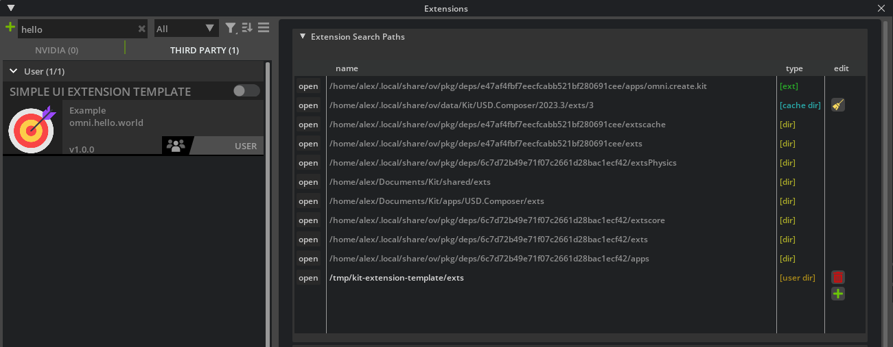

# Python Extensions

```admonish tip title="GitHub Code"
<p style="display: flex; align-items: center;">
  
  All the code in this section is available in public NVIDIA repositories:
  <ul>
    <li><a href="https://github.com/NVIDIA-Omniverse/kit-extension-template">kit-extension-template</a></li>
    <li><a href="https://github.com/NVIDIA-Omniverse/kit-project-template">kit-project-template</a></li>
  </ul>
  Read on to know the differences and which one you should use for your first extension.
</p>
```

Starting developing a Python-only Omniverse extension is quite easy compared to native or mixed extensions and allows you to experiment immediately with the full power of Omniverse.

As [we already said before](../chapter1/kit_applications.md) Python scripts (and an extension is no different) can be executed in Omniverse as long as the Python carbonite plugin is available. This means that there must be a Kit instance somewhere to run a Python extension.

The main difference between the [NVIDIA-Omniverse/kit-extension-template](https://github.com/NVIDIA-Omniverse/kit-extension-template) repo and the [NVIDIA-Omniverse/kit-project-template](https://github.com/NVIDIA-Omniverse/kit-project-template) is exactly how the sample python extension gets to execute in a Kit instance:

## kit-extension-template

In [`kit-extension-template`](https://github.com/NVIDIA-Omniverse/kit-extension-template) two simple scripts (a `.bat` for Windows platforms and a `.sh` for unix platforms) are provided to look for locally installed Kit applications: be it OV Composer, OV Presenter, OV Code or something else.

As the `README.md` mentions, the Omniverse Launcher must be installed and at least one Omniverse Kit-based app should be installed. As [we've already seen](../chapter1/kit_applications.md) OV Launcher keeps a local port open to answer `GET` requests and provide the locally installed path of the omniverse kit-based applications. Executing `link_app` will call some platform-specific scripts developed by NVIDIA in the `tools` directory (this is a very common directory in OV extensions) and eventually execute the following actions:

* install python if not yet available (downloaded from a NVIDIA CDN)
* install [packman](https://docs.omniverse.nvidia.com/kit/docs/carbonite/latest/docs/Packaging.html) which is a NVIDIA-maintained CDN and package manager which ensures Omniverse extensions and projects always have their dependencies available. Most Omniverse projects use `packman` under the hood and its utility scripts often live in a `tools/packman` subdirectory.
* determines where downloaded packages are to be stored on disk (`PM_PACKAGES_ROOT`, by default `$HOME/packman-repo`)
* ensures existence of `7za` for package decompression
* calls some python scripts (`tools/scripts`) to look for omniverse installed apps through the running launcher
* create a soft symbolic link (linux) or symlink (windows) to the Kit-based app directory, so the `kit` executable can be referenced through it

The most important folders in a Python extension repository like this reference one, are outlined below:

```
kit-extension-template/
├─ .vscode/ // contains configuration files to enhance visual studio code editing experience
├─ exts/omni.hello.world // contains the extensions for this repo. Extension names usually have the form
|  |                     // omni.your.extension (with dots between parts/namespaces)
|  ├─ config/ // usually contains extension.toml, the important text toml config for an extension
|  ├─ data/ // binary and/or images specific for this extension
|  ├─ docs/ // documentation files for this extension
|  ├─ omni/
|     ├─ hello/
|        ├─ world/ // if this is a simple py extension, .py code can live here and contain the __init__.py. If this
|           |         is a hybrid (C++ and python) extension, .py code usually goes in a "python" subdirectory here and
|           |         C++ code goes into a "plugins" subdirectory while C++ code for python bindings goes into a
|           |         "bindings" subdirectory. We'll see an example later.
|           ├─ tests/ // unit testing code, test cases are usually derived classes from omni.kit.test.AsyncTestCase
|                        see https://docs.omniverse.nvidia.com/kit/docs/kit-manual/latest/guide/testing_exts_python.html
├─ tools/ // contains NVIDIA-maintained shell/py scripts and tools to facilitate developing, building, publishing and
             documentingOV extensions
```

Since this is a very simple extension which just uses a Kit application already installed somewhere by something else to run a very simple Python extension, everything you need to zip if you wanted to redistribute your Python-only extension to someone else is entirely contained in the `omni.hello.world` folder. All the rest is just script stuff to facilitate developers to create symlinks to a local Kit installation so you can open in vscode your `extension.py` and related files and easily launch it into a Kit instance (or composer instance or presenter instance or anything else kit-based, really).

Here's a sample run

```bash
$ git clone git@github.com:NVIDIA-Omniverse/kit-extension-template.git
# make sure OV launcher is running and OV Composer or any other kit-based app is installed
$ ./link_app.sh
Path is not specified, looking for Omniverse Apps...

Found following Omniverse Apps:
0: Nucleus Workstation (nucleus-workstation) at: '/home/alex/.local/share/ov/pkg/nucleus-workstation-2023.2.0'
1: Cache (cache) at: '/home/alex/.local/share/ov/pkg/cache-2023.2.0-rc.3'
2: USD Composer (create) at: '/home/alex/.local/share/ov/pkg/create-2023.3.0'

Selected app: nucleus-workstation
Creating a link '/tmp/kit-extension-template/tools/scripts/../../app' -> '/home/alex/.local/share/ov/pkg/nucleus-workstation-2023.2.0'
# Nope, nucleus won't do it because it doesn't have a `kit/kit` folder inside, not a kit-based app...
# let's pick another one
$ ./link_app.sh --app create # remember that OV Composer was formerly called Create
Path is not specified, looking for Omniverse Apps...

Found following Omniverse Apps:
0: Nucleus Workstation (nucleus-workstation) at: '/home/alex/.local/share/ov/pkg/nucleus-workstation-2023.2.0'
1: Cache (cache) at: '/home/alex/.local/share/ov/pkg/cache-2023.2.0'
2: USD Composer (create) at: '/home/alex/.local/share/ov/pkg/create-daily-2023.3.0'

Selected app: create
Creating a link '/tmp/kit-extension-template/tools/scripts/../../app' -> '/home/alex/.local/share/ov/pkg/create-2023.3.0'
packman(WARNING): Path '/tmp/kit-extension-template/tools/scripts/../../app' exists but is incorrect. Removing ...
Success!
```

At this point we can either do something like `./app/kit/kit --ext-folder ./exts --enable omni.hello.world` or, if we want to run our sample extension along with other (almost 300) OV extensions in a full instance of OV Composer, we can use

```bash
$ ./app/omni.create.sh --ext-folder exts --enable omni.hello.world
```

note that in the same directory as the `omni.create.sh` script there are usually many other options like `omni.create.singlegpu.sh` to run OV composer in single-gpu mode, `omni.create.hdstorm.sh` to use the non-RTX OpenGL renderer, etc.. these scripts launch `./kit/kit` with different settings and/or `.kit` files (`.kit` files are usually stored in the `./apps` directory for convention, you can take a look at those there as well).

The process above can similarly be accomplished in the OV Composer `Tools->Extensions` browser UI



the Extensions Browser is also an extension itself (so it won't be available unless the kit app has the owning extension `omni.kit.window.extensions` defined in its `.kit` file or loads it manually with `--ext-folder` and `--enable` parameters).

One final note: `packman` is just a very handy package manager from NVIDIA. One could have just as easily not used `packman` and set up the symlinks manually to launch the locally installed Kit-based app with our `omni.hello.world` extension loaded.
In general, everything in the `tools/` directory can be safely copied to any other repository if you're using the NVIDIA maintained utilities to set up, build and facilitate developing Omniverse extensions. In this case `tools/` only had the `packman` tool and a custom-made script in `scripts/`, but we'll see a more complex example in the next pagraph.

## kit-project-template

The [`kit-project-template`](https://github.com/NVIDIA-Omniverse/kit-project-template) is more geared towards developing "projects" rather than extensions, i.e. extensions 'packaged' with all the necessary kit kernel to be e.g. zipped, sent to a user, extracted and (hopefully) work out of the box on an Omniverse capable RTX system.

Quoting from the [official docs](https://docs.omniverse.nvidia.com/kit/docs/kit-template/latest/content.html):

> During build phase extensions are built (native), staged (copied and linked) into `_build/{platform}/{config}/exts` folder. Custom app (.kit file config) is used to enable those extensions.
>
> **Each extension is a folder (or zip archive) in the end. You can write user code in python code only, or C++ only, or both. Ultimately extension archive could contain python code, python bindings (pyd/so files) and C++ plugins (dll/so).** Each binary file is platform and configuration (debug/release) specific. For python bindings naming we follow Python standards.

This time running the same Python extension (still the same `omni.hello.world` window) will **not** require using an external already-installed kit app, but a smaller, lightweight essential Kit distribution will be downloaded instead:

```bash
$ git clone git@github.com:NVIDIA-Omniverse/kit-project-template.git
$ ./pull_kit_kernel.sh
Fetching python@3.10.5-1-linux-x86_64.tar.gz from bootstrap.packman.nvidia.com ...
# lots of deps are fetched ..
Package 'kit-kernel' at version '105.1+release.127680.dd92291b.tc.linux-x86_64.release' is missing from local storage.
Downloading from nvidia_cdn/kit_kernel.zip (68.8 MiB)
100.00% (speed 7.05 MiB/s)
Total of 9.76 seconds
Extracting: kit-kernel@105.1+release.127680.dd92291b.tc.linux-x86_64.release.zip (178 MiB)
100.00% (speed 171 MiB/s)
Total of 1.04 seconds
Package successfully installed to /home/alex/packman-repo-dir/etc..
# kit kernel is now fetched and a symlink ./kit is created
```

Fetching `kit-kernel` instead of a full-blown kit app means downloading a lot less stuff with a clean blank Kit slate (only essential files will be downloaded) - using OV Composer's Kit instance, instead, would have probably meant downloading several Gigabytes of unneeded extensions to run our `omni.hello.world`.

The repository structure is very similar to the previous `kit-extension-template` with the addition of the `pull_kit_kernel` scripts which eventually just call into another script `repo` which invokes the `repoman` tool. Once again: one could have just as easily determined the right kit-kernel to download according to config (release/debug), platform (linux/windows) and kit version (these are defined in a packman `.xml` file in `tools/deps/kit-sdk.packman.xml`), downloaded it instead of `packman` from the NV CDN whose URL can be found in `tools/packman/config.packman.xml` and adjusted all the symlinks themselves. The lightweight `kit-kernel` by default gets downloaded to a temporary directory (something along the lines of `~/packman-repo` on a unix platform) and symlinked to the repository's root (`kit/`) so it's immediately available to launch the extension via a `source/apps/my_name.my_app.(bat|sh)`. These are just scripts that the authors of the repo decided to put in that subdirectory arbitrarily, the takeaway from these is that they all call the kit executable downloaded along with the lightweight `kit-kernel` dependency:


```bash
$ cat source/apps/my_name.my_app.sh # this script just calls the kit instance with a .kit file to load
# our sample extension

#!/bin/bash
set -e
SCRIPT_DIR=$(dirname ${BASH_SOURCE})
exec "$SCRIPT_DIR/../../kit/kit" "$SCRIPT_DIR/my_name.my_app.kit" "$@"
```

When it comes to [packaging an extension](https://docs.omniverse.nvidia.com/dev-guide/latest/dev_guide/package/package.html) to redistribute a single zip file though, especially if the extension is C++ or Hybrid (so it _does_ require building as opposed to a simple Python extension), the `repo_man` collection of tools can be quite useful (`repo_man` gets downloaded via `packman` and invokes the right scripting tools like `repo_build` for OV native/hybrid extensions building, `repo_package` to create packages for extensions, `repo_licensing` for gathering and validating licenses of your dependencies, `repo_format` for py/C++ code linting via clang-format and pyblack, etc.).

Last piece of the puzzle is the packaging of this `kit-project-template` extension: as stated in the `README.md` to package it with this project skeleton just run `tools/package.(bat|sh)` (or `repo package` which invokes, under the hood, exactly the same tool: `tools/packman/python.sh tools/repoman/repoman.py package`, i.e. "use the python interpreter found/downloaded by packman, invoke repoman and execute the 'package' command"). The package will be created in the `_build/packages` folder.

```admonish warning
All folders created via Omniverse repo_man, packaging or build files are _internal and development only_ and not meant to be committed via git or redistributed around if they start with an underscore prefix `_`. E.g. `_build`, `_repo`, `_compiler` and so on. That's the stuff that contains symlinks to create a virtual folder structure (e.g. to reference the right `kit` executable), that gets cleaned via `git clean -dxf` and that you should never write your code into.
```

Before continuing, it might be beneficial spending some words in the next section on the `repo_man` tools before moving on to native extensions and packaging which are more advanced concepts.
